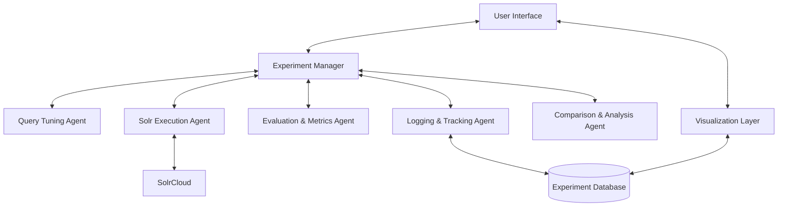
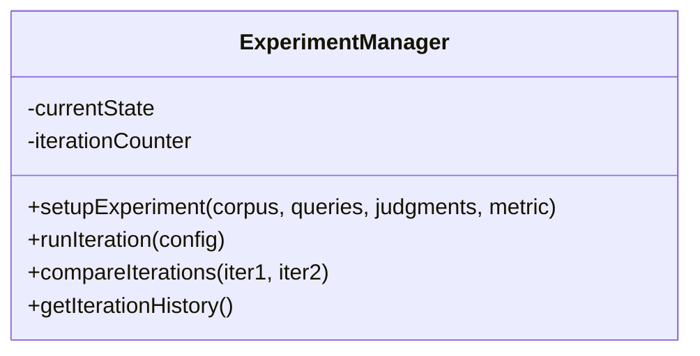
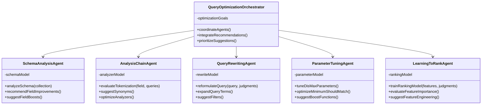
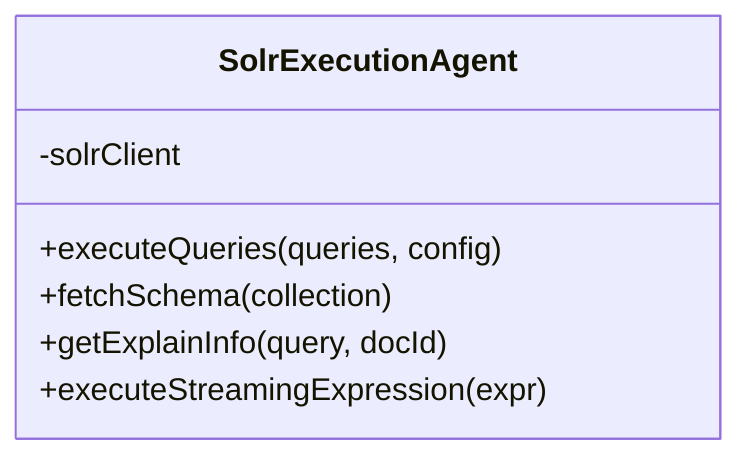
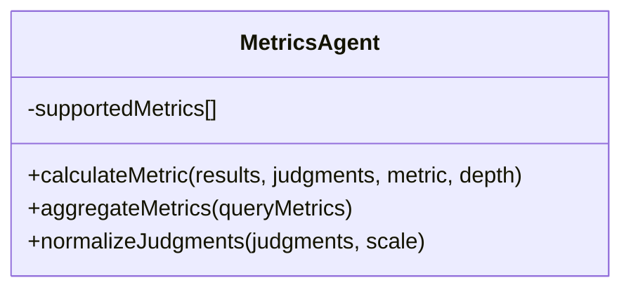
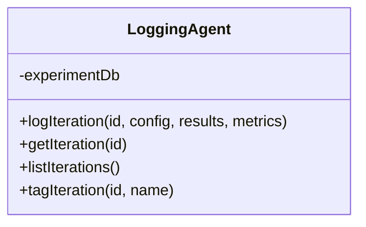
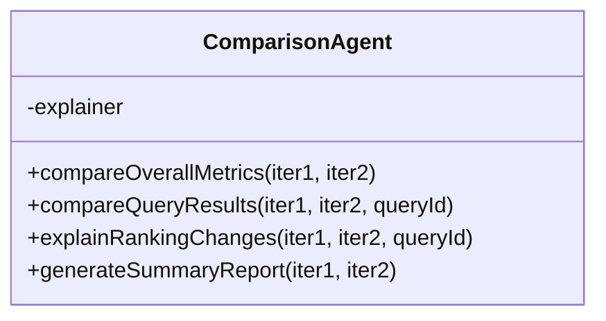

# Solr Optimizer: High-Level Architecture Design

This document outlines the high-level architecture for the Solr query optimization framework based on the requirements specified in OVERVIEW.md.

## System Architecture Overview

The system follows a modular, event-driven architecture with specialized agents that collaborate through a central coordinator:



## Core Components

### 1. Experiment Manager
This central coordinator handles the workflow orchestration and maintains experiment state:



The Experiment Manager:
- Orchestrates the end-to-end process
- Reads user input (selected metric, relevance judgments, corpus/collection name)
- Initializes experiments and coordinates other agents
- Maintains state across iterations
- Ensures comparison between runs (current vs previous by default)

### 2. Query Optimization Agents
A collaborative set of specialized AI agents, each addressing different aspects of query optimization:



Each agent in this collaborative system:
- Leverages MCP (Model Context Protocol) with Pydantic AI to power intelligent decision making
- Specializes in a specific aspect of the query optimization process
- Uses both domain knowledge and machine learning to improve relevance
- Communicates recommendations to the orchestrator which integrates them into a coherent strategy

The specialized agents include:

1. **Schema Analysis Agent**:
   - Analyzes document schemas and field configurations
   - Recommends optimal field boost weights based on relevance patterns
   - Suggests schema modifications to improve searchability

2. **Analysis Chain Agent**:
   - Evaluates and optimizes tokenization, stemming, and other analysis processes
   - Suggests synonym expansions and stopword adjustments
   - Recommends analyzer configurations for different field types

3. **Query Rewriting Agent**:
   - Reformulates queries to improve relevance
   - Expands queries with related terms
   - Suggests query structure changes

4. **Parameter Tuning Agent**:
   - Optimizes DisMax/eDisMax parameters (qf, pf, tie)
   - Tunes minimum_should_match settings
   - Adjusts boosting factors and function queries

5. **Learning-to-Rank Agent**:
   - Creates and optimizes machine learning ranking models
   - Evaluates feature importance
   - Suggests feature engineering improvements

### 3. Solr Execution Agent
Handles all communication with SolrCloud:



The Solr Execution Agent:
- Interfaces with Apache SolrCloud cluster to run queries and retrieve results
- Uses Solr's APIs (SolrJ or HTTP/REST calls)
- Can engage with advanced Solr query features (pivot facets, streaming expressions)
- Retrieves debugging information for result explanation
- Handles collection/core name resolution for corpus reference

### 4. Evaluation & Metrics Agent
Calculates relevance metrics based on query results and judgments:



The Evaluation & Metrics Agent:
- Evaluates rankings against user-provided relevance judgments
- Computes chosen metrics (nDCG@k, ERR@k, MRR, Precision@k, Recall@k)
- Respects specified depth (k) and graded relevance scale
- Supports custom relevance scales
- Leverages existing IR evaluation libraries (RRE, pytrec_eval)
- Produces per-query and aggregate metrics

### 5. Logging & Tracking Agent
Records all experiment data and configuration history:



The Logging & Tracking Agent:
- Records every experiment iteration in detail
- Logs query parameters, configurations, metric scores
- Structures data for analysis and visualization
- Assigns version/iteration identifiers
- Enables full history tracking and experiment branching
- Supports named references to experiments, corpora, and query sets

### 6. Comparison & Analysis Agent
Analyzes differences between iterations:



The Comparison & Analysis Agent:
- Compares results between iterations at multiple levels:
  - Metric level (overall performance changes)
  - Query level (which queries improved/degraded)
  - Document level (ranking changes per document)
- Explains why rankings changed using Solr's explanation details
- Parses debugQuery output to identify score contribution changes
- Provides audit trail and diagnostics for ranking changes

## Data Models

### Experiment Configuration
```json
{
  "experimentId": "holiday_search_optimization",
  "corpus": "ecommerce_products",
  "queries": ["winter jacket", "gift ideas", "..."],
  "judgments": {
    "winter jacket": {
      "doc123": 3,
      "doc456": 1,
      "doc789": 0
    },
    "...": {}
  },
  "primaryMetric": "ndcg",
  "metricDepth": 10,
  "secondaryMetrics": ["precision", "recall"]
}
```

### Query Configuration
```json
{
  "iterationId": "boost_title_x2",
  "queryParser": "edismax",
  "qf": "title^2.0 description^1.0 keywords^0.5",
  "pf": "title^1.5",
  "mm": "2<-1 5<80%",
  "bq": "popularity:[10 TO *]^0.1",
  "ltrModel": "model_v1",
  "ltrEnabled": true
}
```

### Iteration Result
```json
{
  "iterationId": "boost_title_x2",
  "timestamp": "2023-06-15T14:30:00Z",
  "metrics": {
    "overall": {
      "ndcg@10": 0.72,
      "precision@10": 0.65
    },
    "perQuery": {
      "winter jacket": {
        "ndcg@10": 0.85,
        "precision@10": 0.70
      },
      "...": {}
    }
  },
  "comparedTo": "baseline",
  "metricDelta": {
    "overall": {
      "ndcg@10": 0.04
    }
  }
}
```

## Technology Stack

1. **Core Framework**:
   - Java or Python for primary implementation
   - Event-driven architecture with message passing between agents

2. **SolrCloud Integration**:
   - SolrJ (Java) or PySOLR (Python)
   - REST API client for flexibility

3. **Metrics Calculation**:
   - Rated Ranking Evaluator (RRE) or pytrec_eval
   - Custom metric implementation framework for extensibility

4. **Data Storage**:
   - PostgreSQL or SQLite for experiment history
   - JSON/YAML for configuration storage
   - Optional Elasticsearch for logging (if ELK stack available)

5. **Visualization**:
   - Grafana for metrics trends
   - Custom lightweight UI using React/Vue.js
   - Optional integration with Kibana if using ELK

6. **Machine Learning Components** (Advanced):
   - LightGBM for Learning-to-Rank models
   - Scikit-learn for feature importance analysis
   - Ray/RLlib for reinforcement learning optimization strategies

## Workflow Example

1. User configures an experiment specifying:
   - Solr collection ("ecommerce_products")
   - Test queries with relevance judgments
   - Primary metric (nDCG@10)

2. System initializes and runs baseline with current configuration:
   - Analyzes schema to understand fields/types
   - Executes queries using baseline config
   - Computes metrics against judgments
   - Logs baseline results

3. Query Tuning Agent proposes a modification:
   - Increases title field boost by 50%
   - Adds a minimum match parameter

4. System executes the new configuration:
   - Runs the same queries with new parameters
   - Computes metrics
   - Compares against baseline
   - Identifies which queries improved/degraded
   - Explains document rank changes

5. System presents results to user through dashboard:
   - Overall metric changes
   - Per-query breakdowns
   - Document movement analysis
   - Configuration difference highlights

6. User can:
   - Accept the changes
   - Request another automatic iteration
   - Manually modify parameters
   - Compare with any previous iteration
   - Export findings

## Iterative Experimentation and Logging

The framework supports an iterative experiment loop where:

1. **Initial Setup:** The user specifies dataset, test queries, relevance judgments, and metrics.
2. **Iteration Execution:** The system generates configurations, runs queries, evaluates results, and logs outcomes.
3. **Experiment Logging:** Each iteration's data is stored with ID, timestamp, configuration details, metrics, and comparisons.
4. **Named References:** Users can reference corpora, query sets, and iterations by friendly names.

## Performance Comparison and Result Analysis

The system provides comprehensive comparison reports that include:

1. **Overall Metric Changes:** Summary of primary and secondary metric movements.
2. **Per-Query Analysis:** Breakdown of which queries improved or degraded.
3. **Document-Level Ranking Changes:** Detailed view of how individual documents moved in rankings.
4. **Explanation of Changes:** Using Solr's scoring breakdown to explain why documents changed position.

## Integration with Visualization and Dashboard Tools

The framework can integrate with popular open-source visualization platforms:

1. **Direct Dashboard Integration:** Output to Kibana, Grafana, Apache Superset, or Metabase.
2. **Experiment Tracking Platforms:** Integration with MLflow or AimStack for experiment tracking.
3. **API Access:** Clean API for custom visualization development or Jupyter notebook analysis.

## Key Implementation Considerations

1. **Modular Design**: Each agent should be a separate module with clear interfaces, allowing for different implementations or extensions.

2. **Schema Awareness**: The system must deeply understand Solr schemas, analyzing field types, analyzers, and other configurations to make intelligent tuning decisions.

3. **Experiment Persistence**: All experiments should be serializable and reproducible, with proper versioning.

4. **Scalability**: The architecture should handle large query sets and multiple concurrent experiments.

5. **Extensibility**: Easy addition of new metrics, tuning strategies, and visualization methods.

6. **Explainability**: Every tuning decision and result change should be explainable to build trust in the system.

7. **API-First Design**: Expose REST APIs for all functionality to enable integration with other tools.
