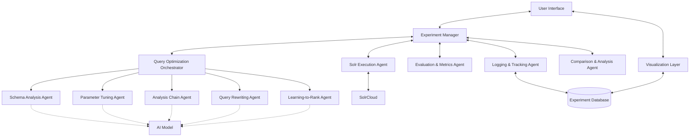
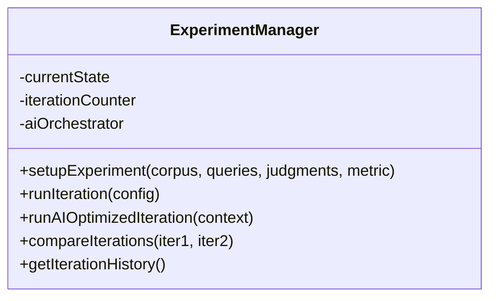
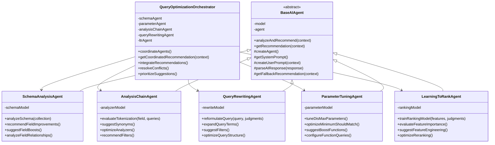
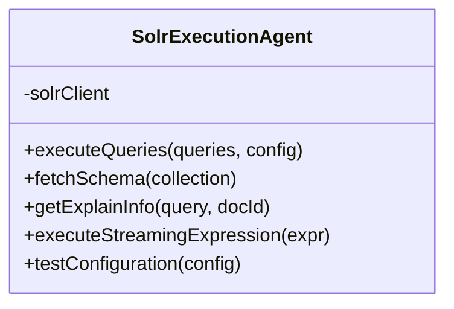
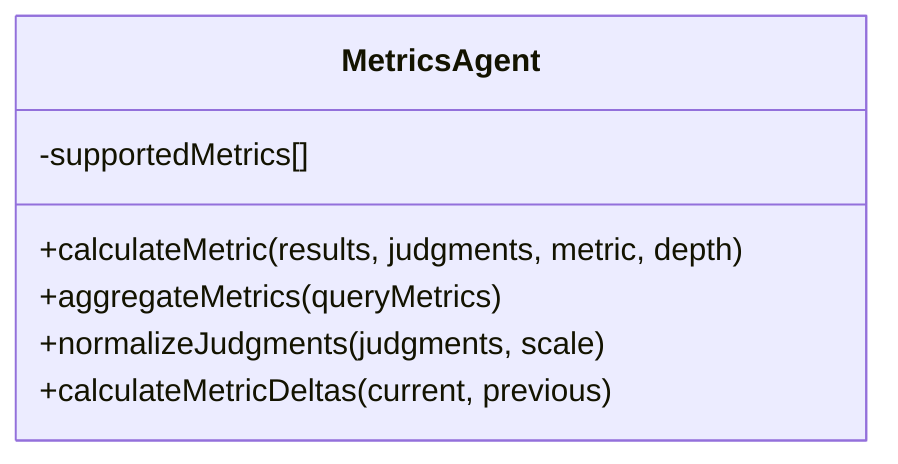
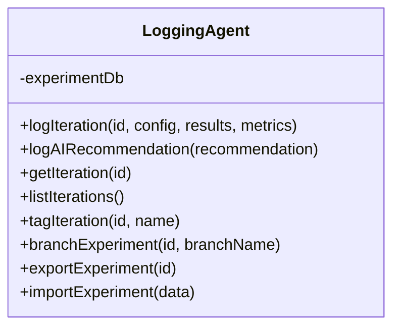
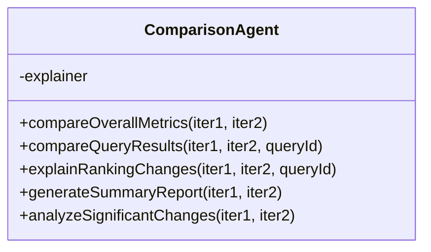

# Solr Optimizer: High-Level Architecture Design

This document outlines the high-level architecture for the Solr query optimization framework based on the requirements specified in OVERVIEW.md, updated to reflect the current implementation including AI-powered optimization agents.

## System Architecture Overview

The system follows a modular, event-driven architecture with specialized agents that collaborate through a central coordinator, enhanced with AI-powered optimization capabilities:



## Core Components

### 1. Experiment Manager
This central coordinator handles the workflow orchestration and maintains experiment state:



The Experiment Manager:
- Orchestrates the end-to-end process
- Reads user input (selected metric, relevance judgments, corpus/collection name)
- Initializes experiments and coordinates other agents
- Maintains state across iterations
- Ensures comparison between runs (current vs previous by default)
- Integrates with AI optimization orchestrator for intelligent iteration planning

### 2. AI-Powered Query Optimization System

The heart of the framework is a sophisticated AI-powered optimization system with specialized agents:



Each AI agent in this collaborative system:
- **Leverages Pydantic AI** with configurable language models (GPT-4, Claude, etc.)
- **Specializes in a specific domain** of query optimization
- **Provides confidence scores, risk assessments, and priority rankings** for recommendations
- **Uses context-aware analysis** including schema information, query patterns, and performance history
- **Includes robust fallback mechanisms** when AI systems fail
- **Communicates recommendations** to the orchestrator which integrates them into a coherent strategy

#### AI Agent Specializations:

1. **Schema Analysis Agent**:
   - Analyzes document schemas and field configurations using AI understanding
   - Recommends optimal field boost weights based on relevance patterns and domain expertise
   - Suggests schema modifications to improve searchability
   - Identifies missing or underutilized fields

2. **Analysis Chain Agent**:
   - Evaluates and optimizes tokenization, stemming, and other analysis processes
   - Suggests synonym expansions and stopword adjustments using semantic understanding
   - Recommends analyzer configurations for different field types and languages
   - Designs custom analyzers for specific content domains

3. **Query Rewriting Agent**:
   - Reformulates queries to improve relevance using natural language understanding
   - Expands queries with semantically related terms
   - Suggests query structure improvements and filter optimizations
   - Optimizes query parser selection and parameters

4. **Parameter Tuning Agent**:
   - Optimizes DisMax/eDisMax parameters (qf, pf, tie) using AI analysis
   - Tunes minimum_should_match settings based on query complexity patterns
   - Adjusts boosting factors and function queries intelligently
   - Balances precision and recall based on optimization goals

5. **Learning-to-Rank Agent**:
   - Creates and optimizes machine learning ranking models
   - Designs feature extraction strategies using domain knowledge
   - Evaluates feature importance and suggests engineering improvements
   - Configures reranking strategies and performance monitoring

6. **Query Optimization Orchestrator**:
   - Coordinates all specialized agents and runs them in parallel
   - Integrates multiple recommendations into coherent strategies
   - Identifies and resolves conflicts between competing suggestions
   - Creates phased implementation plans with validation checkpoints
   - Assesses cumulative risk and provides rollback strategies

### 3. Solr Execution Agent
Handles all communication with SolrCloud:



The Solr Execution Agent:
- Interfaces with Apache SolrCloud cluster to run queries and retrieve results
- Uses Solr's APIs (SolrJ or HTTP/REST calls via PySOLR)
- Can engage with advanced Solr query features (pivot facets, streaming expressions)
- Retrieves debugging information for result explanation and AI analysis
- Handles collection/core name resolution for corpus reference
- Provides schema information to AI agents for intelligent optimization

### 4. Evaluation & Metrics Agent
Calculates relevance metrics based on query results and judgments:



The Evaluation & Metrics Agent:
- Evaluates rankings against user-provided relevance judgments
- Computes chosen metrics (nDCG@k, ERR@k, MRR, Precision@k, Recall@k)
- Respects specified depth (k) and graded relevance scale
- Supports custom relevance scales for domain-specific optimization
- Leverages existing IR evaluation libraries (RRE, pytrec_eval)
- Produces per-query and aggregate metrics for AI analysis

### 5. Logging & Tracking Agent
Records all experiment data and configuration history:



The Logging & Tracking Agent:
- Records every experiment iteration in detail with full configuration history
- Logs AI recommendations, confidence scores, and reasoning
- Structures data for analysis and visualization
- Assigns version/iteration identifiers with branching support
- Enables full history tracking and experiment branching
- Supports named references to experiments, corpora, and query sets
- Provides import/export capabilities for sharing experiments

### 6. Comparison & Analysis Agent
Analyzes differences between iterations with AI-enhanced insights:



The Comparison & Analysis Agent:
- Compares results between iterations at multiple levels:
  - Metric level (overall performance changes with statistical significance)
  - Query level (which queries improved/degraded and by how much)
  - Document level (ranking changes per document with explanations)
  - Configuration level (what parameters changed and their impact)
- Explains why rankings changed using Solr's explanation details
- Parses debugQuery output to identify score contribution changes
- Provides audit trail and diagnostics for ranking changes
- Integrates with AI insights to explain optimization impacts

## Enhanced Data Models

### AI Optimization Context
```python
class OptimizationContext:
    experiment_config: ExperimentConfig
    current_metrics: Dict[str, float]
    schema_info: Dict[str, Any]
    previous_results: List[IterationResult]
    constraints: Dict[str, Any]
```

### AI Agent Recommendation
```python
class AgentRecommendation:
    confidence: float  # 0.0-1.0
    reasoning: str
    suggested_changes: Dict[str, Any]
    expected_impact: str
    risk_level: str  # "low", "medium", "high"
    priority: int  # 1-10
```

### Experiment Configuration (Enhanced)
```json
{
  "experimentId": "ai_powered_search_optimization",
  "corpus": "ecommerce_products",
  "queries": ["winter jacket", "gift ideas", "electronics"],
  "judgments": {
    "winter jacket": {"doc123": 3, "doc456": 1, "doc789": 0}
  },
  "primaryMetric": "ndcg",
  "metricDepth": 10,
  "secondaryMetrics": ["precision", "recall"],
  "aiOptimization": {
    "enabled": true,
    "model": "openai:gpt-4",
    "orchestratorEnabled": true,
    "constraints": {
      "maxRiskLevel": "medium",
      "focusAreas": ["parameter_tuning", "schema_analysis"],
      "avoidLTR": false
    }
  }
}
```

### AI-Enhanced Iteration Result
```json
{
  "iterationId": "ai_orchestrated_optimization_v1",
  "timestamp": "2023-06-15T14:30:00Z",
  "aiGenerated": true,
  "orchestratorStrategy": "coordinated_multi_agent",
  "agentRecommendations": {
    "schema": {"confidence": 0.85, "risk": "low", "priority": 8},
    "parameters": {"confidence": 0.92, "risk": "low", "priority": 9},
    "query_rewriting": {"confidence": 0.78, "risk": "medium", "priority": 6}
  },
  "metrics": {
    "overall": {"ndcg@10": 0.78, "precision@10": 0.72},
    "perQuery": {"winter jacket": {"ndcg@10": 0.89, "precision@10": 0.80}}
  },
  "comparedTo": "baseline",
  "metricDelta": {"overall": {"ndcg@10": 0.08}},
  "significantChanges": ["title field boost increased", "minimum match optimized"],
  "aiInsights": "Multi-agent coordination improved both precision and recall"
}
```

## Technology Stack (Updated)

1. **Core Framework**:
   - Python 3.9+ for primary implementation
   - Event-driven architecture with message passing between agents
   - Modular design with clear separation of concerns

2. **AI and Machine Learning**:
   - **Pydantic AI** for structured AI agent interactions
   - **OpenAI GPT-4** (default) or compatible models (Claude, local models)
   - **LightGBM/XGBoost** for Learning-to-Rank models
   - **Scikit-learn** for feature importance analysis
   - Strong typing with Pydantic models throughout

3. **SolrCloud Integration**:
   - **PySOLR** for Python-based Solr communication
   - REST API client for maximum flexibility
   - Schema API integration for field analysis
   - Advanced feature support (streaming expressions, LTR)

4. **Metrics Calculation**:
   - **pytrec_eval** for standard IR metrics
   - Custom metric implementation framework for extensibility
   - Support for graded relevance and custom scales

5. **Data Storage and Logging**:
   - **File-based storage** with JSON/YAML structured data
   - **SQLite/PostgreSQL** options for larger deployments
   - Comprehensive experiment history with branching
   - Import/export capabilities for data sharing

6. **Visualization and Integration**:
   - **CLI interface** with comprehensive command support
   - **API-first design** for integration with external tools
   - Ready for **Grafana, Kibana, or custom dashboard** integration
   - **MLflow/AimStack** compatibility for experiment tracking

## Enhanced Workflow Example

### AI-Powered Optimization Workflow

1. **User configures an AI-powered experiment**:
   - Solr collection ("ecommerce_products")
   - Test queries with relevance judgments
   - Primary metric (nDCG@10)
   - AI optimization constraints and preferences

2. **System initializes with schema analysis**:
   - AI agents analyze Solr schema and field configurations
   - Baseline configuration is established
   - Initial metrics are computed and logged

3. **AI Orchestrator coordinates optimization**:
   - All specialized AI agents analyze the optimization context
   - Individual recommendations are generated with confidence scores
   - Orchestrator resolves conflicts and creates integrated strategy
   - Implementation phases are planned with validation checkpoints

4. **System executes coordinated optimization**:
   - Phased implementation of AI recommendations
   - Each phase is validated against metrics
   - Rollback capabilities for high-risk changes
   - Continuous monitoring and adjustment

5. **AI-enhanced analysis and reporting**:
   - Detailed comparison with previous iterations
   - AI-generated explanations for ranking changes
   - Performance attribution to specific optimizations
   - Recommendations for future iterations

6. **Iterative improvement with learning**:
   - AI agents learn from experiment outcomes
   - Improved recommendations in subsequent iterations
   - Adaptation to domain-specific patterns
   - Continuous optimization with human oversight

## Implementation Status and Next Steps

### Currently Implemented (Phase 3)
- ✅ Complete AI agent framework with Pydantic AI integration
- ✅ All six specialized AI agents (Schema, Parameter, Analysis Chain, Query Rewriting, LTR)
- ✅ Query Optimization Orchestrator with conflict resolution
- ✅ Comprehensive logging and comparison agents
- ✅ CLI interface with full experiment management
- ✅ File-based storage with branching and import/export

### Next Phase Priorities
- **CLI Integration**: Integrate AI agents into main CLI commands
- **Testing**: Comprehensive test suite for AI agents
- **Configuration Management**: User-friendly AI model and parameter configuration
- **Performance Monitoring**: Track AI recommendation effectiveness over time
- **Documentation**: Usage examples and tutorials for AI-powered optimization

## Key Implementation Considerations

1. **AI Model Configuration**: Support for multiple AI models with graceful fallbacks when services are unavailable.

2. **Context-Aware Optimization**: AI agents use comprehensive context including schema, query patterns, performance history, and user constraints.

3. **Risk Management**: Sophisticated risk assessment with confidence scoring and phased implementation to minimize disruption.

4. **Explainability**: Every AI recommendation includes detailed reasoning and expected impact analysis.

5. **Scalability**: Architecture designed to handle large query sets, multiple concurrent experiments, and high-frequency optimization cycles.

6. **Extensibility**: Easy addition of new AI agents, optimization strategies, and integration with external tools.

7. **Production Readiness**: Robust error handling, fallback mechanisms, and monitoring capabilities for production deployment.

8. **API-First Design**: Comprehensive REST APIs for all functionality to enable integration with existing tools and workflows.

The enhanced architecture represents a significant evolution from traditional rule-based optimization to intelligent, AI-powered query tuning that can understand and optimize complex search configurations with human-level expertise across multiple domains of Solr optimization.
