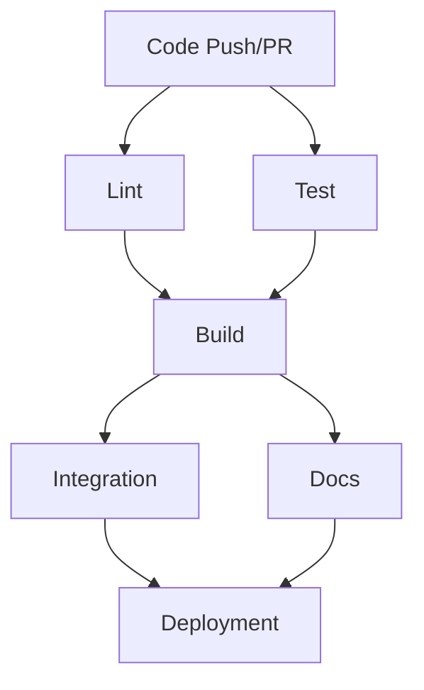

# CI/CD Pipeline Documentation

This document provides information about the Continuous Integration and Continuous Deployment (CI/CD) pipeline set up for the Solr Optimizer project.

## Overview

The Solr Optimizer project uses GitHub Actions to automate testing, building, and deployment tasks. This ensures code quality, maintains test coverage, and streamlines the development process.

## Pipeline Structure

The CI/CD pipeline consists of the following jobs:

1. **Lint**: Code quality checks
2. **Test**: Unit testing across multiple Python versions
3. **Build**: Package building and artifact creation
4. **Integration**: Integration tests with real Solr instance
5. **Docs**: Documentation building



## Jobs Description

### Lint

This job ensures code quality and adherence to the project's coding standards:

- **Black**: Code formatting check
- **isort**: Import sorting check
- **flake8**: Style guide enforcement 
- **mypy**: Static type checking

### Test

Runs unit tests across multiple Python versions to ensure compatibility:

- Tests with Python 3.8, 3.9, 3.10, and 3.11
- Uses pytest with coverage reporting
- Ensures test coverage meets minimum threshold

### Build

Creates distributable package artifacts:

- Builds Python wheel and source distribution
- Uploads artifacts for use in subsequent jobs
- Only runs if linting and tests pass

### Integration

Performs integration tests against a real Solr instance:

- Spins up a Solr container using Docker
- Runs integration tests that validate end-to-end behavior
- Only runs on main branch (not for PRs)

### Docs

Builds project documentation:

- Generates HTML documentation using Sphinx
- Creates API reference docs from docstrings
- Uploads documentation artifacts

## Workflow Triggers

The CI/CD workflow is triggered by:

1. **Push** to the main branch
2. **Pull Requests** targeting the main branch
3. **Manual triggering** via the GitHub UI (workflow_dispatch)

## Setup for Developers

### Local Validation

Before pushing changes, you should validate your code locally:

```bash
# Install development dependencies
pip install -e ".[dev,test]"

# Format code
black .
isort .

# Run linting
flake8 .
mypy solr_optimizer

# Run tests
pytest
```

### Adding New Tests

When adding new features, make sure to:

1. Write unit tests in the appropriate test module under `tests/unit/`
2. Write integration tests under `tests/integration/` if needed
3. Ensure test coverage doesn't decrease

### Working with Protected Branches

The main branch is protected and requires:

1. CI checks to pass
2. Code owner review
3. Up-to-date branch before merging

## Environment Variables

The CI/CD pipeline uses the following environment variables:

| Variable | Description | Used In |
|----------|-------------|---------|
| SOLR_URL | URL to the Solr instance | Integration tests |
| PYTHONPATH | Python module path | All jobs |

## Extending the Pipeline

### Adding a New Job

To add a new job to the workflow:

1. Edit `.github/workflows/ci.yml`
2. Define the new job with appropriate dependencies
3. Configure the necessary steps and environment

### Adding New Dependencies

When adding new dependencies:

1. Update `pyproject.toml`
2. Update the CI install steps if special handling is needed
3. Consider the impact on build times and caching

## Troubleshooting

### Common Issues

1. **Failing Lint Checks**: Run linters locally before pushing
2. **Test Failures**: Run tests in the failing environment locally
3. **Integration Test Failures**: Check Solr connection and configuration
4. **Documentation Build Failures**: Check for broken links or invalid RST

### Workflow Log Analysis

GitHub Actions provides detailed logs for each job. To diagnose failures:

1. Navigate to the Actions tab in the GitHub repository
2. Click the failing workflow run
3. Expand the failing job to see detailed logs

## Best Practices

1. **Never Skip CI**: Avoid using `[skip ci]` in commit messages
2. **Keep Jobs Fast**: Optimize tests and build steps for speed
3. **Review Test Failures**: Always fix failing tests before merging
4. **Update Dependencies Regularly**: Keep Python packages up to date
5. **Monitor Test Coverage**: Maintain or improve coverage over time

## References

- [GitHub Actions Documentation](https://docs.github.com/en/actions)
- [pytest Documentation](https://docs.pytest.org/)
- [Black Documentation](https://black.readthedocs.io/)
- [mypy Documentation](https://mypy.readthedocs.io/)
- [flake8 Documentation](https://flake8.pycqa.org/)
