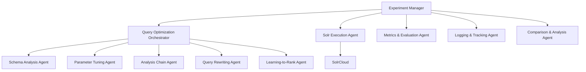

# Solr Optimizer

An AI-powered framework for optimizing Apache Solr queries through systematic experimentation and intelligent recommendations, featuring specialized AI agents that provide deep expertise in search relevance tuning.

## Overview

Solr Optimizer provides a comprehensive set of tools and AI-powered agents for tuning and optimizing Solr search queries based on relevance judgments and user-defined metrics. The framework combines traditional optimization approaches with cutting-edge AI agents that understand document schemas, field types, analysis chains, and all Solr query features.

### Key Features

- **AI-Powered Optimization**: Specialized AI agents using Pydantic AI for intelligent query optimization
- **Systematic Experimentation**: Iterative experiments with different query configurations
- **Comprehensive Metrics**: Standard IR metrics (NDCG, precision, recall, MRR, ERR, etc.)
- **Intelligent Analysis**: AI-driven comparison and ranking change explanation
- **Experiment Tracking**: Complete history and configuration logging
- **Risk-Aware Planning**: Sophisticated risk assessment and phased implementation strategies
- **Multi-Agent Coordination**: Orchestrated optimization strategies across multiple specializations

## Architecture

The framework is built around a modular, agent-based architecture with AI-powered optimization:

### Core Framework Components
- **Experiment Manager**: Orchestrates the workflow between all agents
- **Solr Execution Agent**: Interfaces with SolrCloud clusters
- **Metrics & Evaluation Agent**: Calculates relevance metrics with configurable scales
- **Logging & Tracking Agent**: Records complete experiment history with branching support
- **Comparison & Analysis Agent**: Provides detailed iteration analysis and ranking explanations

### AI-Powered Optimization Agents
- **Query Optimization Orchestrator**: Coordinates all AI agents and resolves conflicts
- **Schema Analysis Agent**: Analyzes document schemas and recommends field optimizations
- **Parameter Tuning Agent**: Optimizes DisMax/eDisMax parameters and boost functions
- **Analysis Chain Agent**: Optimizes text analysis, tokenization, and filter chains
- **Query Rewriting Agent**: Handles query reformulation and expansion strategies
- **Learning-to-Rank Agent**: Creates and optimizes machine learning ranking models



## Installation

### Requirements

- Python 3.9+
- Apache SolrCloud instance
- OpenAI API access or compatible AI model endpoint (for AI agents)

### Setup

```bash
# Clone the repository
git clone https://github.com/sstults/solr-optimizer.git
cd solr-optimizer

# Create and activate a virtual environment (recommended)
python -m venv venv
source venv/bin/activate  # On Windows: venv\Scripts\activate

# Install the package with all dependencies
pip install -e .

# Install development dependencies
pip install -e ".[dev]"
```

### AI Configuration

For AI-powered optimization, you'll need access to an AI model:

```bash
# Set OpenAI API key (for GPT-4 agents)
export OPENAI_API_KEY="your-api-key-here"

# Or configure alternative model endpoints in your code
```

## Usage

### Command Line Interface

The CLI provides comprehensive experiment management capabilities:

```bash
# Create a new experiment with AI-powered optimization
solr-optimizer create-experiment \
    --name "E-commerce Search Optimization" \
    --corpus products \
    --queries-csv queries.csv \
    --judgments-csv judgments.csv \
    --metric ndcg \
    --depth 10

# Run an AI-optimized iteration
solr-optimizer run-iteration \
    --experiment-id exp-12345 \
    --use-ai-orchestrator \
    --qf "title^2.0 description^1.0"

# Compare iterations with detailed analysis
solr-optimizer compare-iterations \
    --experiment-id exp-12345 \
    --iteration1 baseline \
    --iteration2 ai-optimized-1

# List experiment history
solr-optimizer list-iterations --experiment-id exp-12345

# Branch experiment for parallel optimization paths
solr-optimizer branch-experiment \
    --experiment-id exp-12345 \
    --branch-name "ltr-experiments"

# Export experiment data
solr-optimizer export-experiment \
    --experiment-id exp-12345 \
    --output experiment-backup.json

# AI-Powered Commands

# Get AI optimization recommendations
solr-optimizer ai-recommend \
    --experiment-id exp-12345 \
    --ai-model openai:gpt-4 \
    --constraints max_risk=low focus=parameters

# Preview AI recommendations before applying
solr-optimizer ai-preview \
    --experiment-id exp-12345 \
    --ai-model openai:gpt-4

# Run AI-optimized iteration automatically
solr-optimizer ai-optimize \
    --experiment-id exp-12345 \
    --ai-model openai:gpt-4 \
    --constraints min_confidence=0.8

# Check AI system status and configuration
solr-optimizer ai-status --ai-model openai:gpt-4
```

### Python API

#### Basic Experiment Setup

```python
from solr_optimizer.core.default_experiment_manager import DefaultExperimentManager
from solr_optimizer.models.experiment_config import ExperimentConfig
from solr_optimizer.agents.ai import QueryOptimizationOrchestrator

# Initialize experiment manager with AI agents
manager = DefaultExperimentManager(
    # ... standard agents
)

# Set up an experiment
config = ExperimentConfig(
    corpus="ecommerce_products",
    queries=["winter jacket", "holiday gifts", "electronics"],
    judgments={
        "winter jacket": {"doc1": 3, "doc2": 1, "doc3": 0},
        "holiday gifts": {"doc4": 2, "doc5": 3, "doc6": 1},
        "electronics": {"doc7": 3, "doc8": 2, "doc9": 0}
    },
    primary_metric="ndcg",
    metric_depth=10
)

experiment_id = manager.setup_experiment(config)
```

#### AI-Powered Optimization

```python
from solr_optimizer.agents.ai import (
    QueryOptimizationOrchestrator,
    SchemaAnalysisAgent,
    ParameterTuningAgent,
    LearningToRankAgent
)

# Use individual AI agents
schema_agent = SchemaAnalysisAgent()
recommendation = schema_agent.analyze_and_recommend(context)

print(f"Confidence: {recommendation.confidence}")
print(f"Risk Level: {recommendation.risk_level}")
print(f"Expected Impact: {recommendation.expected_impact}")
print(f"Reasoning: {recommendation.reasoning}")

# Use coordinated AI optimization
orchestrator = QueryOptimizationOrchestrator()
strategy = orchestrator.get_coordinated_recommendation(context)

# The strategy includes:
# - Prioritized changes across all optimization areas
# - Implementation phases with validation checkpoints
# - Conflict resolution between competing recommendations
# - Risk assessment and mitigation strategies
```

#### Custom AI Agent Configuration

```python
# Configure AI agents with custom models
orchestrator = QueryOptimizationOrchestrator(
    model="openai:gpt-4",  # or "anthropic:claude-3", etc.
    temperature=0.1,       # Lower temperature for more consistent results
    max_tokens=2000        # Adjust response length
)

# Use agent with specific optimization constraints
context = OptimizationContext(
    experiment_config=config,
    current_metrics=current_metrics,
    schema_info=schema_info,
    previous_results=previous_results,
    constraints={
        "max_risk_level": "medium",
        "focus_areas": ["parameter_tuning", "schema_analysis"],
        "avoid_ltr": True,  # Skip Learning-to-Rank for this experiment
        "preserve_query_structure": True
    }
)

recommendation = orchestrator.get_coordinated_recommendation(context)
```

## Key Components

### AI Agent System

The AI agent system provides intelligent, context-aware optimization:

- **Confidence Scoring**: Each recommendation includes confidence (0.0-1.0)
- **Risk Assessment**: Low/Medium/High risk classification with mitigation strategies
- **Priority Ranking**: Changes prioritized 1-10 based on expected impact
- **Conflict Resolution**: Automatic detection and resolution of competing recommendations
- **Fallback Mechanisms**: Heuristic recommendations when AI fails

### Experiment Management

- **Comprehensive Logging**: Every configuration, metric, and change is tracked
- **Experiment Branching**: Create parallel optimization paths
- **Iteration Comparison**: Detailed analysis of what changed and why
- **Import/Export**: Share experiments and results across teams

### Metrics and Evaluation

- **Standard IR Metrics**: NDCG, DCG, MRR, Precision, Recall, ERR
- **Custom Relevance Scales**: Support for any numeric judgment scale
- **Configurable Depth**: Metrics at any cutoff depth (e.g., NDCG@10, Precision@5)
- **Per-Query Analysis**: Detailed breakdown by individual queries

## Advanced Features

### Learning-to-Rank Integration

```python
from solr_optimizer.agents.ai import LearningToRankAgent

# Create and optimize LTR models
ltr_agent = LearningToRankAgent()
ltr_recommendation = ltr_agent.analyze_and_recommend(context)

# The agent will suggest:
# - Appropriate model types (Linear, LambdaMART, XGBoost)
# - Feature engineering strategies
# - Training parameters and validation approaches
# - Integration with existing Solr infrastructure
```

### Schema-Aware Optimization

```python
from solr_optimizer.agents.ai import SchemaAnalysisAgent

# Analyze document schemas for optimization opportunities
schema_agent = SchemaAnalysisAgent()
schema_recommendation = schema_agent.analyze_and_recommend(context)

# Provides recommendations for:
# - Field boost weights based on relevance patterns
# - Schema modifications for better searchability
# - Field type optimizations
# - Missing field identification
```

### Query Analysis and Rewriting

```python
from solr_optimizer.agents.ai import QueryRewritingAgent

# Intelligent query reformulation and expansion
rewriting_agent = QueryRewritingAgent()
query_recommendation = rewriting_agent.analyze_and_recommend(context)

# Suggests:
# - Query expansion with related terms
# - Query structure improvements
# - Filter and boost query optimizations
# - Parser parameter tuning
```

## Development

### Running Tests

```bash
# Run all tests
pytest

# Run with coverage
pytest --cov=solr_optimizer

# Run specific test categories
pytest tests/unit/
pytest tests/integration/
```

### Code Quality

This project maintains high code quality standards:

```bash
# Format code
black solr_optimizer tests
isort solr_optimizer tests

# Run linting
flake8 solr_optimizer tests

# Type checking
mypy solr_optimizer
```

### Contributing

Contributions are welcome! Key areas for contribution:

- **New AI Agents**: Specialized agents for specific optimization domains
- **Integration Connectors**: Support for additional search platforms
- **Visualization Tools**: Dashboards and reporting improvements
- **Evaluation Metrics**: Additional relevance metrics and evaluation methods

Please see [CONTRIBUTING.md](CONTRIBUTING.md) for detailed guidelines.

## Documentation

- [Overview](OVERVIEW.md) - Detailed project overview and requirements
- [Architecture](ARCHITECTURE.md) - Technical architecture and design decisions
- [Phase 1 Summary](PHASE1_SUMMARY.md) - Foundation and core framework
- [Phase 2 Summary](PHASE2_SUMMARY.md) - Core component implementations
- [Phase 3 Summary](PHASE3_SUMMARY.md) - AI agent system implementation
- [Contributing](CONTRIBUTING.md) - Development guidelines and standards

## License

MIT License - see [LICENSE](LICENSE) for details.

## Acknowledgments

This project builds upon best practices in information retrieval, search relevance tuning, and modern AI/ML frameworks. Special thanks to the Apache Solr community and the developers of Pydantic AI for providing the foundation technologies that make this framework possible.
